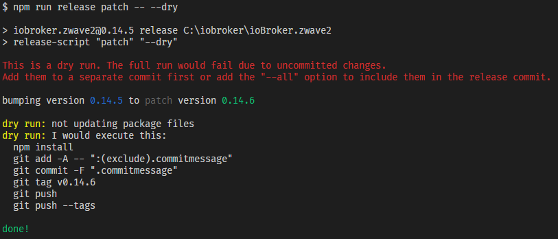

# AlCalzone's Release Script

Automate the monotonous tasks when it comes to releasing new versions of your project. The features include:

-   Bump the version in `package.json` (and `package-lock.json`)
-   Update the changelog headline with the new version and release date whenever a release is made
-   Move old changelog entries into another file
-   Add the changelog to the release commit and create a tag for it.
-   Support for monorepos managed with `lerna` or `yarn workspaces` (using additional `yarn` plugins)
-   Support for custom scripts during the release lifecycle
-   Check licenses for outdated copyrights
-   Dry runs and checking for errors
-   **ioBroker only**:
    -   Bump the version in `io-package.json`
    -   Update the `news` in `io-package.json` and auto-translate the changelog to the other languages
    -   Remove old `news`

Together with the corresponding **Github Actions** workflow (more on that below) this enables auto-publishing on `npm` and `Github Releases` if the build was successful.

## Installation

1. Add this module to your `devDependencies`:

    ```bash
    npm i -D @alcalzone/release-script
    ```

2. Add a new `npm` script in `package.json`:

    ```jsonc
    "scripts": {
        // ... other scripts ...
        "release": "release-script"
    }
    ```

3. Add a placeholder to `README.md` (for your own convenience)

    ```md
    ## Changelog

    <!--
      Placeholder for the next version (at the beginning of the line):
      ### **WORK IN PROGRESS**
    -->
    ```

    or `CHANGELOG.md` if you prefer to have a separate changelog (notice that there is one less `#`):

    ```md
    # Changelog

    <!--
      Placeholder for the next version (at the beginning of the line):
      ## **WORK IN PROGRESS**
    -->
    ```

4. If necessary (e.g. for custom versioning steps) use a [config file](#configuration-with-a-config-file)

## Usage

In order to use this script, you need to maintain the changelog in either `README.md` or `CHANGELOG.md`, because every release must have a changelog. To let the script know which changes are new, use the placeholder:

```md
# Changelog

<!--
    Placeholder for the next version (at the beginning of the line):
    ## **WORK IN PROGRESS**
-->

## **WORK IN PROGRESS**

-   Did some changes
-   Did some more changes

## v0.0.1 (2020-01-01)

Initial release
```

### Separate changelog for old entries

If you are using `README.md`, the script can automatically move old changelog entries to `CHANGELOG_OLD.md` if that exists. The most recent entries are kept in `README.md`. To use this feature, simply create a `CHANGELOG_OLD.md` and give it a headline you like, e.g.

```md
# Older changes
```

### Add free text in the changelog entry headline

You can add free text after the placeholder:

```md
## **WORK IN PROGRESS** - 2020 Doomsday release
```

will be turned into

```md
## 1.2.3 (2020-02-02) - 2020 Doomsday release
```

for example.

### Command line

Once you are ready to release the changes, commit everything so the working tree is clean. Also make sure that you are on the `master` branch. Now you can create a release by executing:

```
npm run release [<releaseType> [<postfix>]] -- [options]
```

or

```
yarn release [<releaseType> [<postfix>]] [options]
```

> When using `npm`, don't forget the extra `--` before specifying options!

You can choose between the following release types:
The available release types are:

| Release type | Description / when to use                                                                                                                                                                                       | Example                             |
| ------------ | --------------------------------------------------------------------------------------------------------------------------------------------------------------------------------------------------------------- | ----------------------------------- |
| `major`      | Breaking changes are introduced. This may include new features and bugfixes.                                                                                                                                    | `0.9.8` -> `1.0.0`                  |
| `premajor`   | Like `major`, but to provide test versions before the final release. **WARNING:** Using this multiple times increases the major version each time.                                                              | `0.9.8` -> `1.0.0-0` -> `2.0.0-0`   |
| `minor`      | A new feature was added **without** breaking things. This may include bugfixes.                                                                                                                                 | `0.9.8` -> `0.10.0`                 |
| `preminor`   | Like `minor`, but to provide test versions before the final release. **WARNING:** Using this multiple times increases the minor version each time.                                                              | `0.9.8` -> `0.10.0-0` -> `0.11.0-0` |
| `patch`      | A bug was fixed without adding new functionality.                                                                                                                                                               | `0.9.8` -> `0.9.9`                  |
| `prepatch`   | Like `patch`, but to provide test versions before the final release. **WARNING:** Using this multiple times increases the patch version each time.                                                              | `0.9.8` -> `0.9.9-0` -> `0.9.10-0`  |
| `prerelease` | Increases only the prerelease suffix. If the current version is not a prerelease, this behaves like `prepatch`. You might want to use this to create multiple test versions (e.g. multiple `premajor` versions) | `0.9.8` -> `0.9.9-0` -> `0.9.9-1`   |

For the `pre*` release types, you can optioinally provide a custom postfix, e.g. `beta`. For example, `npm run release prepatch beta` would result in the following bump: `0.9.8 -> 0.9.9-beta.0`.

> If you omit the `releaseType` or `postfix` options, the release script will ask you for the desired version.

### Command line options

The release script includes a small set of command line options by default. Each loaded plugin may add additional options. Those are described under the corresponding plugin.

#### Show help (`--help` or `-h`)

Example:

```
npm run release -- --help
```

#### Dry run (`--dry`)

The release script makes it possible to test the command before actually changing anything. To do so, use the `--dry` argument. Take care to include the first set of hyphens (`-- --dry`) in the command or **it won't be a dry run**. Here's an example of a dry run that tells you what it would do and that it would fail due to uncommitted changes:  


#### Configuration file (`--config` or `-c`)

Instead of manually providing all options, you can configure the release process with a configuration file. This must be a JSON file

```jsonc
{
	// Boolean, number, string as is:
	"dry": false,
	// Arrays:
	"plugins": ["iobroker", "lerna"],
	// Objects
	"exec": {
		"before_commit": "echo Hello World!"
	}
}
```

or a JS module if you like to do fancy stuff

```js
module.exports = {
	dry: Math.random() * 1000 > 500,
};
```

Example:

```
npm run release -- -c mysuperduperconfig.json
```

> By default, the release script looks for `.releaseconfig.json`

#### Load extra plugins (`--plugins` or `-p`)

An array of plugin names to be loaded. Example:

```
npm run release -- -p iobroker lerna
```

#### Print extra debug information (`--verbose` or `-V`)

Can help debug the release process. Example:

```
npm run release -- -V
```

#### Answer all applicable yes/no prompts with yes (`--yes` or `-y`)

Example:

```
npm run release minor -- --yes
```

## Monorepo support

You can version monorepos in two different ways.

### Using the `yarn` package manager

_**Note:** If possible, prefer this way. Lerna does not support some advanced Yarn features, like `workspace:*` dependency ranges._

Starting with `yarn v3.1.0`, the release script can use Yarn plugins to manage versions and releases of monorepos. These plugins can be installed in your repository as follows:

```bash
yarn plugin import workspace-tools
yarn plugin import version
yarn plugin import https://github.com/Dcard/yarn-plugins/releases/latest/download/plugin-changed.js
```

You also need to make sure that there is a `"version"` field in the root `package.json` file.

To release changed packages, simply run the following command after bumping the versions (ideally during your CI build):

```bash
# without dist-tags
yarn workspaces foreach npm publish --tolerate-republish
# with dist-tags
yarn workspaces foreach npm publish --tolerate-republish --tag my-tag
```

### Using `lerna`

Set up [`lerna`](https://github.com/lerna/lerna) in fixed versioning mode and install and enable the `lerna` plugin (see below). Note that this disables the use of `yarn` plugins.

## Plugins

Since version 3, the release script is separated into several plugins, making it easy to extend it with custom checks. The following plugins are installed and loaded by default and don't need to be installed separately:

| Plugin name | Description                                            |
| ----------- | ------------------------------------------------------ |
| `changelog` | Parse and update the changelog                         |
| `exec`      | Run custom scripts during the release lifecycle        |
| `git`       | Check git status, make commits and push                |
| `package`   | Check and update `package.json`, synchronize lockfiles |
| `version`   | Determine the version bump                             |

If you need some of these plugins, you have to install and them separately:

| Plugin name     | Description                                                                        |
| --------------- | ---------------------------------------------------------------------------------- |
| `iobroker`      | Update ioBroker's `io-package.json`                                                |
| `lerna`         | Monorepo support with `lerna`                                                      |
| `license`       | Check for outdated years in license files                                          |
| `manual-review` | Asks you to review the changes before committing and lets you do additional edits. |

To do so, add them as a `devDependency`:

```jsonc
// package.json
// ...
  "devDependencies": {
    "@alcalzone/release-script": "3.0.0",
    "@alcalzone/release-script-plugin-iobroker": "3.0.0",
    // ... others ...
  }
```

If possible, the version for the plugins should be the same as the one for `@alcalzone/release-script`.

### Stages

The release process is separated into stages. By default, the following stages are active:

```
check → edit → commit → push → cleanup
```

but each plugin can define its own stages.

### `git` plugin options

#### Include other changes in the release commit (`--includeUnstaged` or `--all`)

Although the release commit should only include the changes relevant to the version increase, sometimes it makes sense to include other changes in the release commit. For this purpose, you can use the `--all` option, e.g.:

```bash
npm run release patch -- --all
```

#### Using a different remote (`--remote` or `-r`)

By default, the release script pushes to the remote the current branch points to. If you want to specify a different one, you can use this flag.
Make sure to use the complete remote branch name:

```bash
npm run release patch -- -r upstream/master
```

### `changelog` plugin options

#### Limit the number of entries in README.md (`--numChangelogEntries` or `-n`)

Only applies when the changelog is in `README.md` and a `CHANGELOG_OLD.md` exists. By default the most recent 5 entries are kept in `README.md`.

#### Add a new placeholder after a successful release (`--addPlaceholder`)

If you want the release script to add a new empty placeholder to the changelog after a release, this option is for you. By default, this is disabled.

### `package` plugin options

#### Don't synchronize the lockfile (`--no-update-lockfile`)

After bumping the version, the lockfile is normally synchronized with `package.json` to avoid errors on CI. If this is not desirable, you can disable the behavior.

### `version` plugin options

#### Replace the version in additional files (`--versionFiles`)

To replace the version in additional files, you can use the `--versionFiles` option. It is recommended to define it via a configuration file. The option expects an array of tuples containing glob patterns to match files and one or more regular expressions to match the version to be replaced.

> In order for this to work, the regular expressions must surround the version to replace with lookbehind `(?<=BEFORE_VERSION)` and lookahead `(?=AFTER_VERSION)` assertions. Additional backslashes are needed to escape the special characters because of JSON.

<!-- prettier-ignore -->
```jsonc
{
	"versionFiles": [
		// Match `>Version: VERSION<` in html files in the widget folder
		// and replace VERSION with the new version
		["widget/*.html", "(?<=\\>Version: )(.*?)(?=<)"],
		// Check all files in the template folder and its subdirectories
		["templates/**/*.*", [
			// Match `"version": "VERSION",` and replace VERSION with the new version
			"(?<=\"version\": \")(.*?)(?=\",)",
			// Match `Version: "VERSION"` and replace VERSION with the new version
			"(?<=Version: \")(.*?)(?=\")"
		]]
  ]
}
```

### `exec` plugin options

#### Run scripts during release lifecycle (`--exec` or `-x`)

To run custom scripts, you can use these options. They accept an object defining the stage in/after/before which scripts should be executed. To execute multiple commands in sequence, you can also use an array of strings. Example:

```jsonc
{
	"exec": {
		// Run "echo Hello" in the "commit" stage
		"commit": "echo Hello",
		// Run "echo 1", "echo 2", "echo 3" after the "push" stage
		"after_push": ["echo 1", "echo 2", "echo 3"],
		// Run "sudo shutdown" before the "check" stage
		"before_check": "sudo shutdown"
	}
}
```

You can also define these on the command line (if you really must):

```
npm run release -- -x.commit "echo Hello" -x.after_push "echo 1" "echo 2" "echo 3" -x.before_check "sudo shutdown"
```

### `lerna` plugin options

#### Publish all packages (`--publishAll`)

By default, `lerna` only bumps and publishes changed packages. With this flag, all non-private packages are re-published under a new version, even if they had no changes.

### `ioBroker` plugin options

#### Change where `io-package.json` is found (`--ioPackage` or `-io`)

The release script expects `io-package.json` in the package root. If that is not the case, for example if you're building a monorepo, you can change that path:

```bash
npm run release patch -- -io packages/js-controller
```

#### Avoid prerelease versions in `io-package.json` (`--ioPackageNoPrerelease`)

Usually, the version in `io-package.json` and `package.json` must match and the script will raise an error if they don't.

```jsonc
// package.json:
"version": "1.2.4",

// io-package.json:
"common": {
  "version": "1.2.3" // not OK ❌
  // ...
}
```

However, if you don't want to put a prerelease version like `v1.2.3-alpha.0-abcdefg` in `io-package.json`, you can enable this flag:

```bash
npm run release patch -- --ioPackageNoPrerelease
```

In this case, only the major/minor/patch part is used for `io-package.json`:

```jsonc
// package.json:
"version": "1.2.3-alpha.0-abcdefg",

// io-package.json:
"common": {
  "version": "1.2.3" // OK ✔
  // ...
}
```

#### Skip the release workflow check

The release script tries to find common errors in the ioBroker Github Actions release workflow file. If the check results in a false positive, you can disable this check with the `--no-workflow-check` option.

```bash
npm run release patch -- --no-workflow-check
```

#### Limit the number of news in `io-package.json` (`--numNews` or `-nn`)

By default the most recent 7 news entries are kept in `io-package.json`. Using this option, you can change the limit.

### `license` plugin options

#### Change where to look for license files to check (`--license`)

By default, the files `LICENSE`, `README` with and without `.md` extension are checked (glob `"{LICENSE,README}{,.md}"`). Using this option, you can define an array of glob patterns to change the search paths.

```bash
npm run release patch -- --license "**/LICENSE" "packages/*/README.md"
```

### `manual-review` plugin options

_none_

## Workflow file for automatic release

When using Github Actions, you can enable automatic release on `npm` and `Github Releases` after a tagged build was successful. To do so, include the following job in your workflow definition file (e.g. `.github/workflows/test-and-release.yml`) and configure it to depend on the build jobs (here, they are called `unit-tests`).
The workflow must be configured to run when tags are pushed.

Furthermore, you need to create a token in your npm account and add it to your repository secrets with the name `NPM_TOKEN`.

<!-- prettier-ignore -->
```yml
# Run this workflow on all pushes and pull requests
# as well as tags with a semantic version
on:
  push:
    # Configure your tested branches here, I like to check all of them. You can leave this out if you only want to deploy
    branches:
      - "*"
    # You MUST limit tags to ones that are compatible with the version scheme this script uses. DO NOT include any others or they will be released aswell
    tags:
      # normal versions
      - "v[0-9]+.[0-9]+.[0-9]+"
      # pre-releases
      - "v[0-9]+.[0-9]+.[0-9]+-**"
  # This runs the workflow for all pull requests. You can leave this out if you only want to deploy
  pull_request: {}

jobs:
  #
  # ... your other jobs go here ...
  #

  # Deploys the final package to NPM and Github Actions
  deploy:
    # Trigger this step only when a commit on master is tagged with a version number
    if: |
      contains(github.event.head_commit.message, '[skip ci]') == false &&
      github.event_name == 'push' &&
      startsWith(github.ref, 'refs/tags/v')

    # Define which jobst must succeed before the release
    needs: [unit-tests]

    runs-on: ubuntu-latest
    strategy:
      matrix:
        node-version: [14.x]

    steps:
      - name: Checkout code
        uses: actions/checkout@v2

      - name: Use Node.js ${{ matrix.node-version }}
        uses: actions/setup-node@v1
        with:
          node-version: ${{ matrix.node-version }}

      - name: Extract the version and commit body from the tag
        id: extract_release
        # The body may be multiline, therefore we need to escape some characters
        run: |
          VERSION="${{ github.ref }}"
          VERSION=${VERSION##*/v}
          echo "::set-output name=VERSION::$VERSION"
          BODY=$(git show -s --format=%b)
          BODY="${BODY//'%'/'%25'}"
          BODY="${BODY//$'\n'/'%0A'}"
          BODY="${BODY//$'\r'/'%0D'}"
          echo "::set-output name=BODY::$BODY"

      # If you are using TypeScript, additional build steps might be necessary
      # Run them here, e.g.:
      # - name: Install dependencies
      #   run: npm ci
      # - name: Create a clean build
      #   run: npx gulp build

      - name: Publish package to npm
        run: |
          npm config set //registry.npmjs.org/:_authToken=${{ secrets.NPM_TOKEN }}
          npm whoami
          npm publish

      - name: Create Github Release
        uses: actions/create-release@v1
        env:
          GITHUB_TOKEN: ${{ secrets.GITHUB_TOKEN }}
        with:
          tag_name: ${{ github.ref }}
          release_name: Release v${{ steps.extract_release.outputs.VERSION }}
          draft: false
          # Prerelease versions create prereleases on Github
          prerelease: ${{ contains(steps.extract_release.outputs.VERSION, '-') }}
          body: ${{ steps.extract_release.outputs.BODY }}
```
